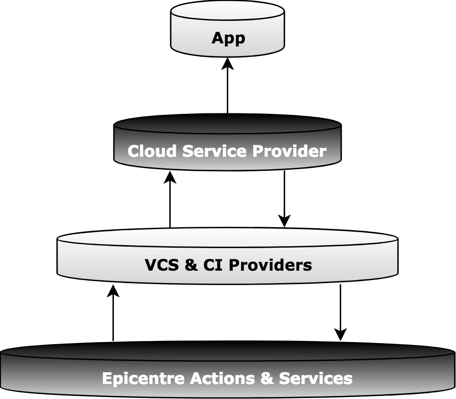
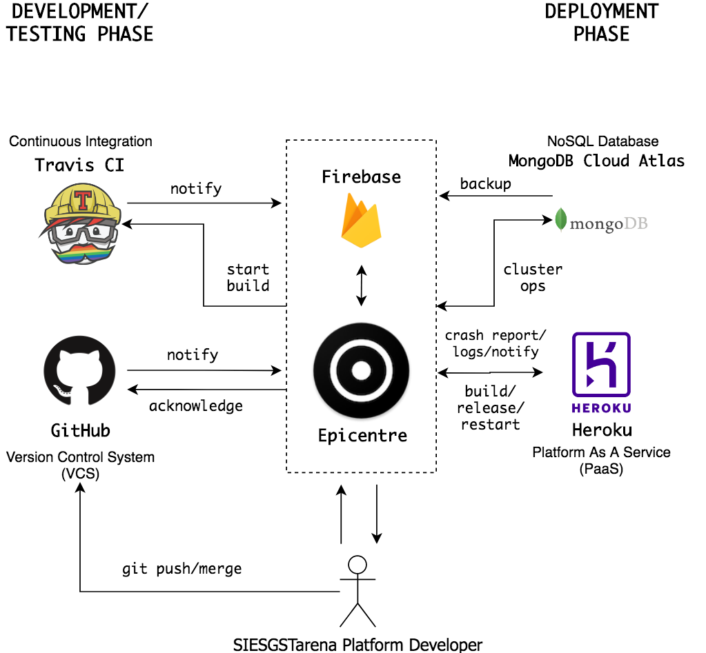

<h1>
	
 	Epicentre
</h1>

Cloud Monitoring and Deployment Tool built by SIESGSTarena Platform Team

## About The Project
<center></center>
<br/>

### Roadmap (Contributions Encouraged!)
 - To work on adding other cloud service providers like Amazon Web Services (AWS) and Google Cloud Platform (GCP)
 - Providing integration other VCS providers like GitLab and BitBucket
 - Adding more CI service providers like Circle CI, etc.
 - Adding more information and management options in existing system.

### How Can You Contribute?
Read the [Contributing Guidelines](CONTRIBUTING.md) to know how easy it is to contribute to this project!

## Usage

### Setting Up Actions
 - **GitHub**
	* Create an *Access Token* for your GitHub Account with all permissions [(Reference)](https://help.github.com/articles/creating-a-personal-access-token-for-the-command-line/)
 - **Travis CI**
 	* Create an *API Token* for your Travis CI account with all permissions [(Reference)](https://developer.travis-ci.com/authentication)
 - **Heroku**
	* Generate a *Heroku Token* from account settings page or create a new one from CLI [(Reference)](https://devcenter.heroku.com/articles/platform-api-quickstart#authentication)
### Setting Up Security Keys For Authentication 
* Copy this file and update the configurations in your new .env file
* Update the new .env with your data for the project
* Create a **Firebase Project** and make sure you have following things set up:
	* Enable Public Read/Write for your Firebase Storage [(Reference)](https://firebase.google.com/docs/storage/security/start)
	* Enable Public Read/Write for your Firebase Realtime Database [(Reference)](https://firebase.google.com/docs/database/security/quickstart)
	* Create a new Firebase Storage Bucket
	* Create a new Private Key by visiting the Project Settings Page > Service Accounts.
* Create a new folder keys inside config to save encryption keys (Note: file names should be exactly same)
	* keys/_private.key_ - Private Key generated from any online service
	* keys/_public.key_ - Public Key generated from any online service
	* _serviceAccount.json_ - Private Key generated from Firebase Console

### Install the NPM dependencies
```
npm install
```
### Run the server
```
npm start
npm run start-dev
```
### (Development) Testing and Fixing Code Quality
```
npm run tslint
tslint --fix --project .
```
### (Development) Run tests
```
npm run test
```

## Architecture 
<center></center>

## License

	Copyright 2019 SIESGSTarena

	Licensed under the Apache License, Version 2.0 (the "License");
	you may not use this file except in compliance with the License.
	You may obtain a copy of the License at

		http://www.apache.org/licenses/LICENSE-2.0

	Unless required by applicable law or agreed to in writing, software
	distributed under the License is distributed on an "AS IS" BASIS,
	WITHOUT WARRANTIES OR CONDITIONS OF ANY KIND, either express or implied.
	See the License for the specific language governing permissions and
	limitations under the License.
